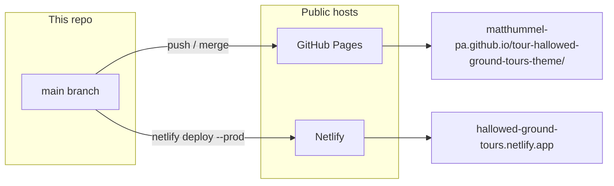
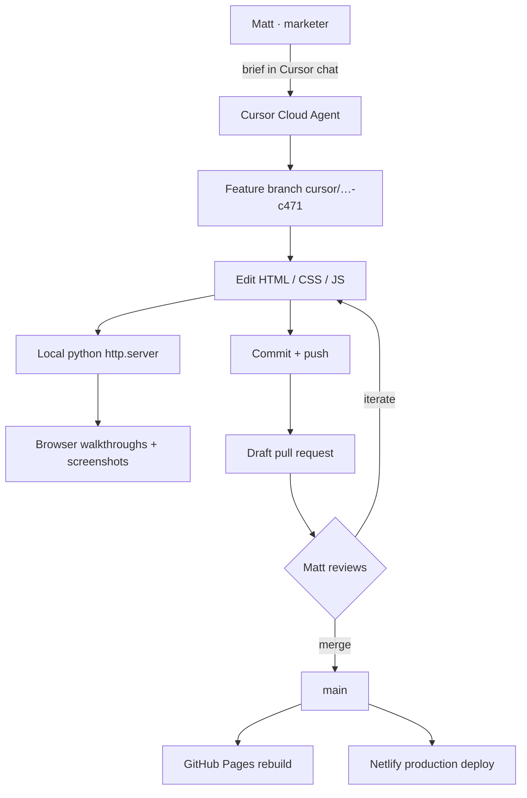
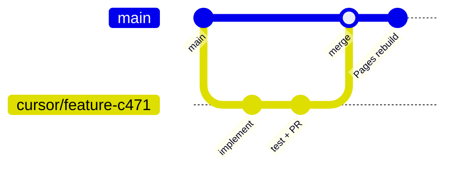

# Hallowed Ground Battlefield Tours

<p align="center">
  
</p>

<p align="center">
  <a href="#what-this-repo-is-for"></a>
  <a href="#live-urls"></a>
  <a href="#how-it-was-built"></a>
  <a href="#features"></a>
  <a href="#repo-map"></a>
  <a href="#git-workflow"></a>
</p>
<p align="center">
  <a href="#deployment"></a>
  <a href="#github-settings-used-on-this-repo"></a>
  <a href="#cursor-setup-for-this-project"></a>
  <a href="#concept-vs-later-wordpress"></a>
  <a href="#license"></a>
</p>

<p align="center">
  
</p>

<p align="center">
  <strong>Concept marketing site</strong> for a licensed-guide tour company in Gettysburg, Pennsylvania.<br>
  Built in the browser as static HTML — designed so a later Sage / Roots / WooCommerce theme can pick up the same pages.
</p>

<p align="center">
  <a href="https://hallowed-ground-tours.netlify.app"></a>
  <a href="https://matthummel-pa.github.io/tour-hallowed-ground-tours-theme/"></a>
  <a href="LICENSE"></a>
  
</p>

<p align="center">
  <a href="https://hallowed-ground-tours.netlify.app">Open Netlify</a>
  ·
  <a href="https://matthummel-pa.github.io/tour-hallowed-ground-tours-theme/">Open GitHub Pages</a>
  ·
  <a href="https://github.com/matthummel-pa/tour-hallowed-ground-tours-theme">Source</a>
</p>

```
┌─────────────────────────────────────────────────────────────┐
│  HALLOWED GROUND · BATTLEFIELD TOURS · GETTYSBURG, PA       │
│  Ridges & Valleys Studio concept · not a live ticket office │
└─────────────────────────────────────────────────────────────┘
        │
        ├── Day tours meet · 100 Sample Street (concept)
        ├── Lantern walk · sample downtown flagpole
        └── Phone (717) 555-0100 · tours@hallowedground.test
```

---

<a id="what-this-repo-is-for"></a>

## What this repo is for

This is the **working HTML demo** for Hallowed Ground Battlefield Tours — a Gettysburg / Adams County company that sells small-group walking, bus, hike, lantern, and private sunrise tours led by Association of Licensed Battlefield Guides.

It exists so marketing and product decisions can happen **in the actual pages**, not in a slide deck:

| Job | What the demo proves |
| --- | --- |
| Brand | A field-dispatch look (compass, ticket-cut cards, slate + gold) distinct from the sister food-tour site |
| Local SEO | Titles, meta, Open Graph, JSON-LD, NAP, and Adams County town copy stay in sync |
| Tours & booking | Five named tours, filters, and a multi-step checkout concept |
| The Area | An interactive Gettysburg map guests can actually use |
| Handoff | Sage comments in the markup map HTML to future Blade / WooCommerce templates |

It is **not** a live storefront. Address, phone, and email are labeled concept / fiction-range placeholders so nothing here can be mistaken for a real office.

```
Live NAP (do not treat as a real business)
──────────────────────────────────────────
100 Sample Street, Gettysburg, PA 17325
(717) 555-0100  ·  +1 717 555 0100
tours@hallowedground.test
Schema geo: 39.83, −77.23 (coarse downtown, not a street pin)
```

**Source of this repo:** copied out of `ridgesandvalleys` (`concept/tour-hallowed-ground-tours/`) so this theme can live on its own. Future HTML work belongs **here**.

---

<a id="live-urls"></a>

## Live URLs



| Host | URL | How it updates |
| --- | --- | --- |
| **GitHub Pages** | [github.io demo](https://matthummel-pa.github.io/tour-hallowed-ground-tours-theme/) | Automatic on every push to `main` (branch `/`, HTTPS on) |
| **Netlify** | [hallowed-ground-tours.netlify.app](https://hallowed-ground-tours.netlify.app) | Manual or CLI `netlify deploy --prod` · dashboard [hallowed-ground-tours](https://app.netlify.com/projects/hallowed-ground-tours) |

Canonical tags in the HTML still point at the GitHub Pages path so SEO stays on one origin until you choose otherwise.

---

<a id="how-it-was-built"></a>

## How it was built

### Stack (deliberately thin)

```
┌──────────────┐   ┌──────────────┐   ┌───────────────────┐
│  HTML pages  │──▶│  styles.css  │──▶│  main.js / book.js │
│  + JSON-LD   │   │  tokens      │   │  area-map.js       │
└──────────────┘   └──────────────┘   └─────────┬─────────┘
                                                │
                     ┌──────────────────────────┼──────────────┐
                     ▼                          ▼              ▼
              OpenLayers 10              OpenStreetMap    Esri World Imagery
              OSM buildings              ~800 monuments   Satellite toggle
              (OpenFreeMap MVT)          + Commons PD
```

No bundler. No framework runtime. Open a file or any static server. Headings use self-hosted **Playfair Display** (bold high-contrast serif). UI is **Atkinson Hyperlegible**. Labels are **IBM Plex Mono**.

Map data:

- Tour geography → [`data/area-map.json`](data/area-map.json)
- Monuments → [`data/monuments.json`](data/monuments.json) (OSM coordinates + Wikimedia Commons public-domain / CC0 photos, rebuilt with [`scripts/build-monuments.py`](scripts/build-monuments.py))
- Map framing → [`data/maps-config.json`](data/maps-config.json)

Owner demo CMS for pins uses `localStorage` (`admin.html`). A live theme would persist to WordPress (ACF / CPT), which is already noted in Sage comments.

### How Matt developed it (Cursor + GitHub)

Work happened **in the files**, with Cursor as the editor and Cloud Agents as the extra pair of hands — not as a separate design tool.



Practices that actually happened on this repo:

1. **Cursor Desktop / Cloud Agents** — briefs like “redesign as its own identity,” “sample NAP only,” “OpenLayers not Google,” “popup + satellite,” “itinerary PDF.”
2. **Project subagent** — [`.cursor/agents/hallowed-ground-copy.md`](.cursor/agents/hallowed-ground-copy.md) keeps voice, tour names, prices, and NAP consistent across pages.
3. **Netlify Cursor skills** — forms (`data-netlify` itinerary mail), `netlify.toml` publish dir, CLI deploy.
4. **GitHub** — public repo, feature branches, pull request #3, merge to `main`.
5. **Evidence in the PR** — screen recordings and screenshots of the map, popups, satellite, and PDF download — not mockups.

Typical branch name from Cloud Agents:

```
cursor/<short-description>-c471
```

---

<a id="features"></a>

## Features

### Site

| | Feature |
| --- | --- |
| **Home** | Dual pathways (historical / after-dark), tour cards, booking band |
| **Tours** | All five products, category filter, FAQs, CTAs |
| **Guides** | Licensed-guide positioning — roles, not invented personal bios |
| **The Area** | Field map, battlefield copy, parking, directions, nearby towns |
| **Book** | Multi-step date → party → checkout concept (`book.js`) |
| **Contact** | Sample NAP, hours, FAQ accordion, demo contact form |
| **Admin** | Owner map editor behind a demo gate (`admin.html`) |

### The Area map

```
  MAP / SATELLITE          gold 4 = cluster
         │                 (click to zoom in)
         ▼
   ┌───────────┐     ┌─────────────────────┐
   │  Gettysburg│◀───│ Filters             │
   │  OSM or    │    │ ☑ Monuments         │
   │  satellite │    │ ☑ Tour locations    │
   └─────┬─────┘    │ ☑ Buildings         │
         │          │ ☑ Popular areas     │
         ▼          └─────────────────────┘
   Popup: name · PD photo · coordinates
         │
         ▼
   Add to itinerary → Save PDF / Print / Mail request
```

- OpenLayers + OSM streets and OpenFreeMap building footprints (no Google key)
- Satellite via Esri World Imagery
- ~800 clickable OSM monuments; PD/CC0 photos when a Commons match exists
- Numbered gold circles = **clusters** (a `4` is four monuments at this zoom)
- Legend + layer filters
- Click pin → popup; close / Escape / empty map → zoom back to the field
- Guest itinerary: add stops, **Save as PDF** on device, print, or Netlify Form / `mailto:` fallback to `tours@hallowedground.test`

### Brand & SEO (kept in lockstep)

- Unique `<title>`, meta description, canonical, Open Graph on every public page
- JSON-LD `TravelAgency` + tour / FAQ where used
- Ticket-cut UI, compass mark, parchment/gold/ink palette
- Sage `<!-- sage:begin … -->` comments for the WordPress handoff

---

<a id="repo-map"></a>

## Repo map

```
tour-hallowed-ground-tours-theme/
├── assets/
│   ├── hallowed-ground-logo.svg   README lockup
│   ├── hallowed-ground-mark.svg   Compass mark
│   └── readme-menu/               README section buttons
├── index.html          Home
├── tours.html          Catalog
├── guides.html         Guides
├── area.html           The Area + map chrome
├── book.html           Checkout concept
├── contact.html        NAP + FAQ
├── admin.html          Owner map editor
├── styles.css          Tokens + layout
├── main.js             Nav, FAQ, newsletter demo
├── book.js             Booking flow
├── area-map.js         OpenLayers map, filters, itinerary
├── data/
│   ├── area-map.json
│   ├── maps-config.json
│   └── monuments.json
├── scripts/build-monuments.py
├── netlify.toml        publish = "."
├── .nojekyll           GitHub Pages: do not run Jekyll
└── .cursor/agents/     Copy / NAP subagent
```

### Local preview

```bash
python3 -m http.server 8765 --directory .
# http://127.0.0.1:8765/
```

Or open `index.html` directly. Map tiles need a network connection.

Rebuild monument photos (optional, hits OSM + Commons APIs):

```bash
python3 scripts/build-monuments.py
```

---

<a id="git-workflow"></a>

## Git workflow



1. Branch from `main` (`cursor/…-c471` for Cloud Agents).
2. Commit in logical chunks (copy, map, NAP, etc.).
3. Push and open a **draft PR** until it is ready.
4. Merge to `main` (merge commit is enabled on this repo).
5. Pages rebuilds; optionally `netlify deploy --prod`.

```bash
git checkout main
git pull origin main
git checkout -b cursor/my-change-c471
# …edit, commit…
git push -u origin cursor/my-change-c471
```

---

<a id="deployment"></a>

## Deployment

### A. GitHub Pages (automatic)

Pages is already on for this repo.

| Setting | Value on this repo |
| --- | --- |
| Source | **Deploy from a branch** (classic / “legacy” Pages) |
| Branch | `main` |
| Folder | `/` (root) |
| HTTPS | Enforced |
| Visibility | Public site |
| URL | `https://matthummel-pa.github.io/tour-hallowed-ground-tours-theme/` |

`.nojekyll` is in the root so GitHub does not process the site as a Jekyll project (underscore paths, etc.).

**If a new fork 404s:**  
GitHub → **Settings → Pages → Build and deployment → Source: Deploy from a branch → `main` / `/ (root)` → Save.**

First publish can take a minute. Check **Settings → Pages** for the green check and the site URL.

### B. Netlify (CLI production)

```toml
# netlify.toml
[build]
  publish = "."
```

```bash
npx netlify login          # or: netlify login --request "…" for an agent
npx netlify status
npx netlify sites:create -a <account-slug> -n hallowed-ground-tours
npx netlify deploy --prod --dir .
```

This project’s production site: **[hallowed-ground-tours.netlify.app](https://hallowed-ground-tours.netlify.app)**  
Project: [app.netlify.com/projects/hallowed-ground-tours](https://app.netlify.com/projects/hallowed-ground-tours)

The itinerary **mail** form uses `data-netlify="true"` (`name="itinerary-mail"`). Enable **Forms** in the Netlify UI so submissions collect. On GitHub Pages the same form falls back to `mailto:tours@hallowedground.test`.

Do not commit `.netlify/` (already gitignored).

---

<a id="github-settings-used-on-this-repo"></a>

## GitHub settings used on this repo

Documented from the live GitHub API for `matthummel-pa/tour-hallowed-ground-tours-theme` so a new clone can match.

### General

| Setting | This repo |
| --- | --- |
| Visibility | **Public** |
| Description | Concept website for a Gettysburg tour company |
| Homepage | GitHub Pages URL |
| Default branch | `main` |
| Issues | On |
| Wiki | On |
| Projects | On |
| Discussions | Off |
| License | MIT (Matt Hummel, 2026) |

### Pull requests

| Setting | This repo |
| --- | --- |
| Merge commits | Allowed |
| Squash merge | Allowed |
| Rebase merge | Allowed |
| Auto-delete head branch | Off |

Suggested extras (not required today): branch protection on `main` (require PR, linear history optional), and turning **auto-delete branches** on after merge.

### Pages

**Settings → Pages**

1. Build and deployment → **Deploy from a branch**
2. Branch: **`main`**
3. Folder: **`/ (root)`**
4. Save
5. Confirm **Enforce HTTPS**

### Actions / environments

Pages “legacy” branch deploys do not need a GitHub Actions workflow. If you later switch to **GitHub Actions** as the Pages source, add a workflow; the current site does not use one.

### Secrets

None required for the static demo. Never put Netlify auth tokens or provider map keys in the repo. Netlify login uses the CLI (`NETLIFY_AUTH_TOKEN` only in the local/CI environment).

---

<a id="cursor-setup-for-this-project"></a>

## Cursor setup for this project

```
.cursor/
└── agents/
    └── hallowed-ground-copy.md    # NAP, tours, voice
```

When working in Cursor:

- Prefer **editing the HTML** over a spec dump.
- Invoke the Hallowed Ground copy agent for headlines, meta, FAQ, and booking copy.
- Keep tour **names, prices, caps, and meeting points** identical on every page.
- Use Netlify skills for forms, `netlify.toml`, and deploys.

Cloud Agents on this repo used a branch prefix `cursor/` and a run suffix so parallel work did not collide.

---

<a id="concept-vs-later-wordpress"></a>

## Concept vs later WordPress

Sage comments in the HTML (`sage:begin` / `sage:template`) mark where a Roots Sage theme would take over. The intended live stack is **Sage + WooCommerce**, with this demo as the front-end contract.

Until that theme ships:

- Booking and contact forms are **demos** (they do not charge a card or send production email unless Netlify Forms is on).
- Guide pages do not invent real people.
- Parking copy stays generic downtown lots — no fake loading zone.

---

<a id="license"></a>

## License

[MIT](LICENSE) © 2026 Matt Hummel.

Photograph credits on the map popups belong to Wikimedia Commons authors (public domain / CC0 / U.S. government) as labeled on each file. Map data © OpenStreetMap contributors (ODbL). Satellite tiles © Esri, Maxar, Earthstar Geographics, and the GIS User Community.
